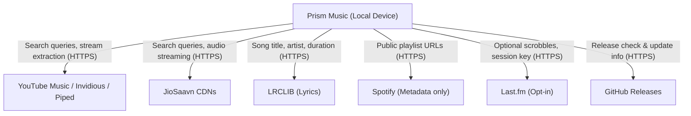

# Prism Music — Privacy Policy & Data Flow

**Last updated:** October 8, 2026

Prism Music is an open-source, local-first music application for Android. We respect your privacy and believe you should know exactly what data stays on your device and what data is transmitted across the network.

---

## 1. Summary

- **No user accounts:** You do not need to register, log in, or provide an email to use the core application.
- **No ads:** There are no advertising SDKs, banner ads, or sponsored content.
- **No first-party tracking or analytics:** Prism Music does not operate a tracking backend, telemetry collector, or crash reporting server.
- **Local-first data:** Your likes, playlists, playback history, and listening stats are stored on your device.
- **Direct third-party streaming:** When you search or stream songs, your device connects directly to external providers (such as YouTube Music, JioSaavn, and LRCLIB) over encrypted HTTPS. Those third parties see standard HTTP requests (including your IP address and search queries) necessary to provide audio and metadata.

---

## 2. What Data Stays on Your Device

All core user data is stored locally using Hive databases and app-private filesystem storage:

| Data Type | Storage Location | Retention & Lifecycle |
|---|---|---|
| **Liked Songs & Playlists** | App-private storage (`hive/`) | Retained until you delete them or clear app data |
| **Playback History & Stats** | App-private storage (`hive/`) | Retained locally; can be cleared anytime in Settings |
| **Search History** | App-private storage (`hive/`) | Retained locally; can be cleared in Search / Settings |
| **Downloaded Music** | App-owned storage (`Android/data/.../files/Prism_Music/` or user-selected folder) | Retained until deleted in Downloads page |
| **Cached Lyrics & Artwork** | App cache directory (`cache/`) | Evicted by the OS or cleared via Settings |
| **Settings & Preferences** | App-private storage (`hive/`) | Retained until app uninstall or settings reset |
| **Backups** | App-private storage (`prism_backup_private.json`) by default; optional shared copy (`Documents/Prism_Music_Backup/`) | Survives reinstall **only** if shared copy or manual export is enabled |

### Reinstall Survival & Backup Architecture
By default (following security hardening S03), backups are written to app-private storage. Android removes app-private storage when an application is uninstalled.

To preserve your library across an uninstall and reinstall:
1. **Shared Storage Backup (Opt-in):** In Settings → Backup & Restore, you can enable writing a backup copy to shared device storage (`Documents/Prism_Music_Backup/prism_backup.json`).
2. **Manual Export:** You can export a JSON backup file to any directory using the system file picker.
3. **Restore:** Upon reinstalling Prism Music, you can import and restore your backup file. The app validates backup schema, structural depth, array lengths, and canonical file paths (S01, S06) before restoring.

---

## 3. External Network Requests & Data Flow

Prism Music does not operate an intermediary proxy or proprietary backend server. All network requests are initiated directly from your device to third-party public APIs and content delivery networks.

### Detailed Provider Breakdown

#### A. YouTube Music & Video Proxies (Piped / Invidious)
- **What is sent:** Search terms, artist/album IDs, video identifiers, standard HTTP user-agent headers.
- **What is received:** Search results, playlist metadata, audio stream URLs and audio stream byte chunks.
- **Privacy consideration:** Requests are sent to Google/YouTube CDNs or community proxy instances (Piped, Invidious) without authentication cookies or Google account login. The receiving server sees your IP address and requested video stream.

#### B. JioSaavn
- **What is sent:** Search terms, track IDs, audio quality parameters.
- **What is received:** Track metadata and audio stream byte chunks.
- **Privacy consideration:** Stream requests go directly to JioSaavn content servers over HTTPS.

#### C. LRCLIB (Lyrics)
- **What is sent:** Song title, artist name, album name, and track duration.
- **What is received:** Plain text or synchronized (LRC) lyrics.
- **Privacy consideration:** LRCLIB is a community-run open lyrics service. No personal or device identifiers are sent.

#### D. Spotify (Playlist Imports)
- **What is sent:** Spotify playlist URLs you explicitly paste into the app.
- **What is received:** Public playlist HTML and metadata.
- **Privacy consideration:** Prism Music fetches the public web page for the playlist and parses the track names to match them on YouTube Music. The app does not ask for or store Spotify user account credentials.

#### E. Last.fm (Optional Scrobbling)
- **Default state:** Disabled.
- **What is sent:** Song title, artist, playback timestamp, and authentication tokens if you explicitly connect your Last.fm account.
- **Storage:** Session keys are stored in hardware-backed secure storage (Android Keystore / EncryptedSharedPreferences via `flutter_secure_storage`).
- **Control:** You can disconnect your Last.fm account at any time in Settings.

#### F. GitHub (Update Checks)
- **What is sent:** Standard GET request to the GitHub Releases API to check for newer application versions.
- **What is received:** Release tag, changelog notes, and APK download links.

---

## 4. Permissions Used

Prism Music follows a principle of least privilege, requesting permissions strictly just-in-time:

- **Notifications (`POST_NOTIFICATIONS` on Android 13+):** Requested only to display the ongoing media playback notification and lock-screen playback controls. If denied, playback continues, but Android media controls may not be visible.
- **Battery Optimization Exemption:** An optional prompt helps prevent aggressive Android OEM task killers from prematurely killing background playback. Not required for playback.
- **Storage / Media Access:** Requested only when you explicitly select a custom download folder outside of app-specific storage or choose to import/export backups from external storage. The app does **not** request blanket all-files access (`MANAGE_EXTERNAL_STORAGE`).

---

## 5. Security Practices

We continuously review and harden the application's security posture:
- **HTTPS Enforcement:** Cleartext HTTP traffic is disabled globally via Android Network Security Configuration (`android:networkSecurityConfig`), preventing inadvertent plaintext transmissions.
- **Path Canonicalization & Containment:** File deletions and download saves are strictly validated against approved application directory roots, preventing path traversal attacks.
- **Sanitized Logging:** Release builds strip verbose query parameters, tokens, and signed streaming URLs from logs.
- **Secure Key Storage:** Credentials are saved in Android Keystore-backed secure storage rather than plaintext boxes.
- **Supply Chain Integrity:** CI build workflows pin action dependencies to immutable git commit SHAs, scan dependencies with OSV-Scanner, and produce Software Bill of Materials (SBOM) and SLSA build provenance attestations for releases.

---

## 6. Open Source Verification

Because Prism Music is completely open source under the MIT License, anyone can audit our source code, network requests, and dependencies:
- **Repository:** [https://github.com/Jeswanth-009/Prism-Music](https://github.com/Jeswanth-009/Prism-Music)
- **Security Inquiries & Audit Reports:** See [SECURITY.md](SECURITY.md) and [docs/audits/](docs/audits/).

---

## 7. Contact & Changes

If you have questions or concerns about privacy in Prism Music, please open an issue or security advisory on [GitHub](https://github.com/Jeswanth-009/Prism-Music/issues). Any updates to this policy will be documented in this file and reflected in release notes.
