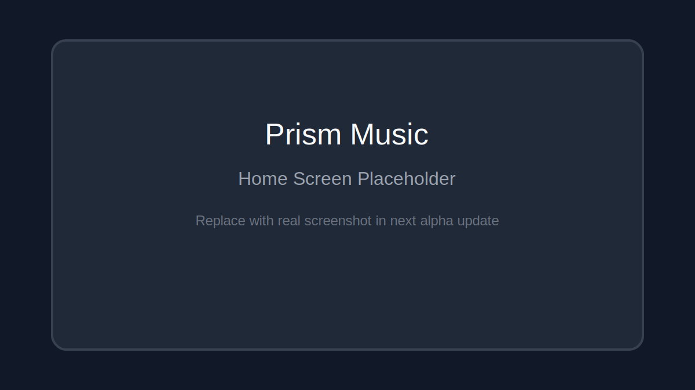
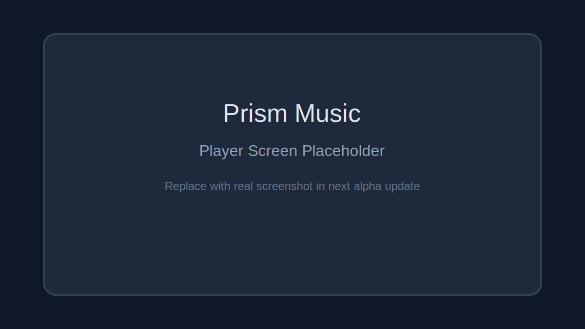
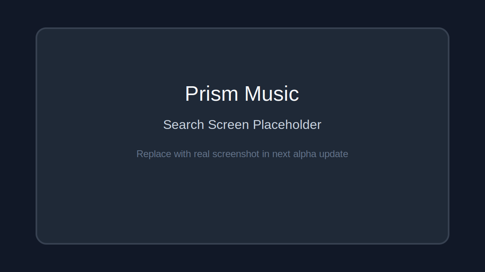

# Prism Music

[](https://github.com/Jeswanth-009/Prism-Music/actions/workflows/ci.yml)
[](https://github.com/Jeswanth-009/Prism-Music/actions/workflows/release-alpha.yml)
[](LICENSE)

Open-source, privacy-first music streaming app built with Flutter.

Prism Music is in a very early alpha stage. Current work is focused on building a strong engineering base: reliable search, resilient playback, and recommendation quality, with transparent open-source development.

## Alpha Status

- Stage: Early alpha
- Current version: 0.1.0+6
- Primary target: Android
- Stability: Experimental, breaking changes may happen between alpha builds

## Screenshots and Demo

### Current placeholders

These placeholders keep README layout ready while real screenshots are collected from alpha devices.

| Home | Player | Search |
| --- | --- | --- |
|  |  |  |

### GIF walkthrough

- Planned for next alpha documentation pass
- Target file path: docs/media/prism-alpha-demo.gif

## Why Prism Music Is Different

Most mainstream music apps are optimized around account lock-in and platform-owned funnels.
Prism Music is intentionally engineered with a different set of priorities.

### Core differentiators

- Privacy-first usage model with no mandatory login for core flow
- Fallback-first reliability for search, recommendations, and playback
- Performance-first playback path with cache and pre-resolve strategies
- Open architecture and public release automation from early alpha stage

## Feature Comparison

| Capability | Prism Music (Alpha) | Typical Music Apps |
| --- | --- | --- |
| Core usage without mandatory login | Yes | Usually no |
| Open-source code visibility | Yes | Usually no |
| Search fallback behavior | Typed parse plus raw fallback | Mostly single-path or opaque |
| Recommendation fallback behavior | Multi-path with safety net | Service-specific and closed |
| Stream startup optimization | Cache-first and pre-resolve aware | Varies by platform |
| Public release pipeline visibility | Yes, GitHub Actions | Often internal only |

## What Has Been Done So Far

| Area | Completed Work | Current Outcome |
| --- | --- | --- |
| Architecture | Layered core/data/domain/presentation design with DI and BLoC | Cleaner separation and maintainability |
| Search | YT Music focused service and mapper pipeline with fallback handling | Better resilience on parser edge cases |
| Recommendations | Multi-path recommendation flow with fallback logic | Reduced empty-state queue failures |
| Playback | Stream loader plus cache strategy and reliability hardening | Faster repeat play and improved stability |
| Open source | CI/CD workflows, changelog, license, contributing docs | Public, reproducible alpha delivery |

## Public Roadmap

| Milestone | Target Date | Status | Scope |
| --- | --- | --- | --- |
| Alpha hardening wave 1 | 2026-04-20 | In progress | Analyzer cleanup, failure handling, test additions |
| Alpha hardening wave 2 | 2026-05-15 | Planned | Playback polish, diagnostics, recommendation refinements |
| Rich alpha baseline | 2026-06-30 | Planned | Library and playlist UX improvements |
| Beta readiness review | 2026-08-15 | Planned | Regression checks, quality gates, stabilization |
| v1.0 planning checkpoint | 2026-10-01 | Planned | Scope lock, privacy posture, release readiness |

Dates are target estimates and may move based on quality and contributor velocity.

## Architecture Overview

Prism Music follows a layered structure:

- Presentation: pages, widgets, BLoCs
- Domain: entities and contracts
- Data: repository implementations and data sources
- Core: DI, services, mappers, utilities

High-level pipelines:

- Search: UI -> SearchBloc -> MusicRepository -> YT Music service -> mapper -> UI
- Playback: PlayerBloc -> stream loader/cache -> audio engine
- Recommendations: PlayerBloc -> recommendation service -> repository fallback -> queue update

Deep architecture docs are listed later in this README.

## Tech Stack

- Flutter + Dart
- BLoC: flutter_bloc, bloc
- Dependency injection: get_it, injectable
- Audio stack: just_audio, audio_service, just_audio_background
- Networking/data: dart_ytmusic_api, youtube_explode_dart, dio
- Local persistence: hive

## Project Structure

```text
lib/
  core/
    di/
    mappers/
    services/
  data/
    datasources/
    repositories/
  domain/
    entities/
    repositories/
  presentation/
    blocs/
    pages/
    widgets/
```

## Getting Started

### Prerequisites

- Flutter stable SDK
- Recommended Flutter version: 3.38.4
- Android Studio or VS Code
- Android SDK and emulator/device

### Install

```bash
flutter pub get
```

### Run

```bash
flutter run
```

### Build

```bash
flutter build apk --debug
flutter build apk --release
```

## CI/CD and Release Automation

### CI workflow

File: .github/workflows/ci.yml

Runs on push and pull request:

- flutter pub get
- flutter analyze --no-fatal-infos --no-fatal-warnings
- flutter test
- flutter build apk --debug
- Upload debug APK artifact

### Alpha release workflow

File: .github/workflows/release-alpha.yml

Runs automatically on every push to main (and also supports manual tag pushes matching alpha-v*):

- Builds release APK and AAB
- Generates SHA-256 checksum files
- Fails the workflow if APK output is missing
- Uploads APK and AAB as workflow artifacts
- Publishes GitHub prerelease artifacts with APK attached every run
- Uses contents write permissions for release publishing

### Signed release support via GitHub Secrets

Release signing is automatically enabled when these repository secrets are set:

- ANDROID_KEYSTORE_BASE64
- ANDROID_KEY_ALIAS
- ANDROID_KEYSTORE_PASSWORD
- ANDROID_KEY_PASSWORD

When secrets are missing, workflow still builds using debug signing fallback.

## Versioning Strategy

Prism Music uses Flutter version format:

```text
version: MAJOR.MINOR.PATCH+BUILD_NUMBER
```

Alpha guidance:

- Keep MAJOR at 0 during unstable phase
- Increase BUILD_NUMBER for each distributable build
- Automated releases use tag format: alpha-v<version>-build<build>-run<workflow run>
- Optional manual releases can use tags like: alpha-v0.1.0-build6

## Publish Next Alpha

1. Update version in pubspec.yaml.
2. Commit and push to main branch.
3. Release is created automatically with APK and AAB assets.

Optional manual trigger via tag:

```bash
git tag alpha-v0.1.0-build6
git push origin alpha-v0.1.0-build6
```

4. Wait for release-alpha workflow to publish prerelease artifacts.

## Collaboration Workflow

- Bug report template: .github/ISSUE_TEMPLATE/bug_report.yml
- Feature request template: .github/ISSUE_TEMPLATE/feature_request.yml
- PR template: .github/pull_request_template.md
- Security policy: SECURITY.md

See CONTRIBUTING.md for contribution expectations.

## Documentation

- ARCHITECTURE.md
- STREAM_ARCHITECTURE.md
- BACKEND_INTEGRATION.md
- IMPLEMENTATION_SUMMARY.md
- PRISM_MUSIC_DOCUMENTATION.md
- MUSIC_APPS_DOCUMENTATION.md

## License

MIT License. See LICENSE.
