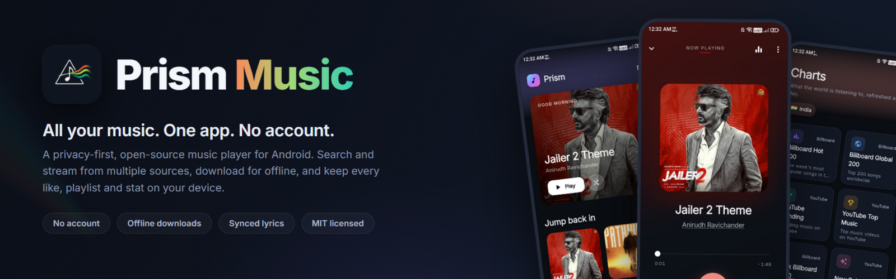
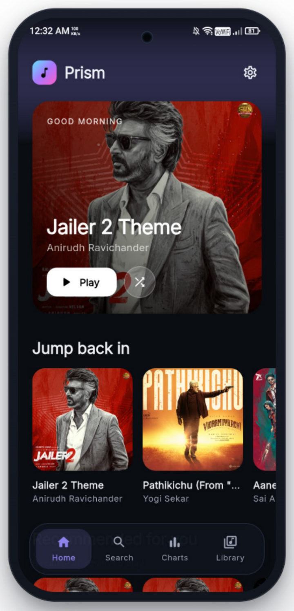
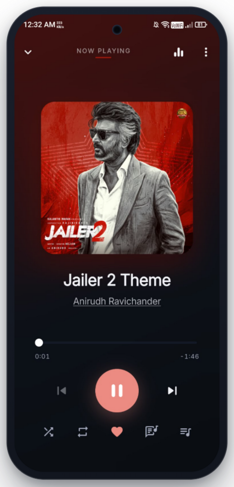
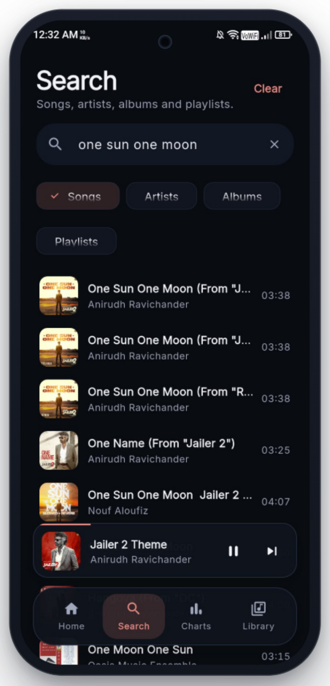
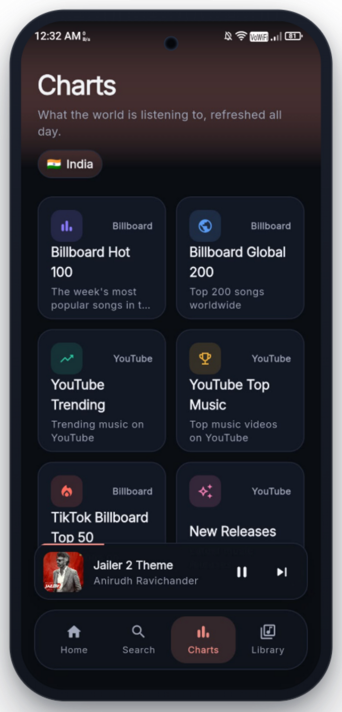
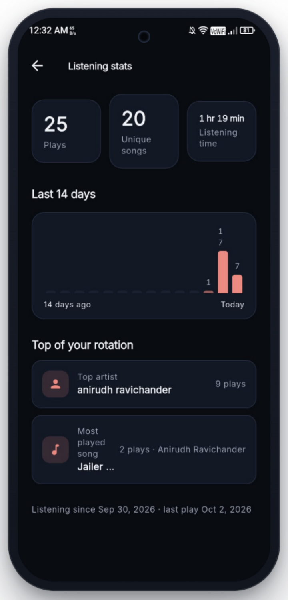
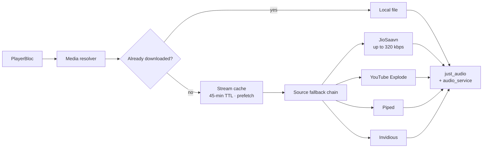

<div align="center">



**A privacy-first, open-source music player for Android, built with Flutter.**
Search and stream from YouTube Music and JioSaavn, download for offline, scrobble to Last.fm — and keep every like, playlist and play count on your device. No account. No ads. No first-party tracking. Streams and lyrics are fetched directly from external services over HTTPS without an intermediary backend (see [PRIVACY.md](PRIVACY.md)).

[](https://github.com/Jeswanth-009/Prism-Music/actions/workflows/ci.yml)
[](https://github.com/Jeswanth-009/Prism-Music/releases)
[](https://github.com/Jeswanth-009/Prism-Music/releases)
[](https://flutter.dev)
[](LICENSE)
[](CONTRIBUTING.md)

[Download](#download--install) · [Features](#features) · [How it works](#how-it-works) · [Privacy](PRIVACY.md) · [Documentation](#documentation) · [Contributing](#contributing) · [Website](https://jeswanth-009.github.io/Prism-Music/)

</div>

## Screenshots

| Home | Now Playing | Search |
| :---: | :---: | :---: |
|  |  |  |

| Charts | Listening stats | |
| :---: | :---: | :---: |
|  |  | |

## Why Prism Music

- **No account.** Search, play, like and download — nothing in the core flow asks you to sign in.
- **Local-first.** Likes, playlists, history and stats live in an on-device database with zero cloud telemetry. Backups live in app-private storage by default, with an opt-in shared copy or manual export to survive uninstalls.
- **Direct streaming.** Streams, search results and lyrics are fetched directly from public third-party endpoints over HTTPS with no middleman proxy or logging server.
- **Fallback-first playback.** Four independent stream sources, request retries and a circuit breaker keep songs playing when one path fails.
- **Open pipeline.** CI, release automation and architecture docs are public from day one; every push to `main` ships a signed build.

## Features

**Streaming & Audio Engine**

- YouTube Music catalog search — songs, artists, albums and playlists
- Multi-source playback with an automatic fallback chain: JioSaavn (up to 320 kbps) → YouTube Explode → Piped → Invidious with 15s overall resolution budget and circuit breakers
- Quality tiers: Low (64 kbps), Medium (128 kbps), High (256 kbps), Ultra (320 kbps Opus) / Lossless
- Stream caching with composite keying (`videoId` + quality) and expiration parsing, so repeat plays start instantly
- Dynamic native equalizer and audio effects dynamically bound to the active audio session ID, with ±6 dB treble shelf and bass boost
- Seamless crossfade (0–10s configurable) and authoritative audio focus orchestration that never auto-resumes after an explicit user pause

**Player & UI**

- Background playback with lock-screen and media-notification controls
- Synced lyrics from LRCLIB with auto-scroll, plus an offline lyrics cache
- Editable queue — play next, reorder, remove — with shuffle, repeat, sleep timer (including true end-of-track completion mode), and 0.25–2.0× speed
- Jitter-free seek slider with local drag preview and seek on release
- Adaptive accent color dynamically extracted from artwork and cached per track identity
- AutoPlay toggle switch with generation tracking to prevent queue flooding

**Downloads & Offline Experience**

- Resilient offline download pipeline: atomic temporary file download (`.tmp` → validated rename), 60s timeout, and audio container integrity checks
- Direct stream reuse eliminating redundant network resolutions
- Offline metadata and artwork caching for uninterrupted offline library search and playback
- Real-time download progress updates and delete notifications synchronized across the app

**Library & Persistence**

- Liked songs, recently played, playlists, and downloads
- Full listening-stats page: plays, unique songs, listening time, a 14-day chart, and top rotation based on retained history
- Safe optimistic library mutations with automatic rollback on persistence errors
- Serialized playlist mutations preventing race conditions
- Import playlists from Spotify or YouTube links with token-based fuzzy confidence scoring
- Atomic on-device JSON backups (app-private storage by default, with opt-in shared storage copy or export) with newest-timestamp restoration
- Granular cache controls showing measured disk usage and comprehensive cleanup (image disk cache, lyrics, and streams)
- Fail-safe startup with bounded initialization timeouts and a `StartupErrorApp` recovery screen

## Download & install

1. Grab the latest APK from [Releases](https://github.com/Jeswanth-009/Prism-Music/releases) — every push to `main` publishes a signed `alpha-vX.Y.Z-buildN` prerelease with APK, AAB and SHA-256 checksums.
2. On the device, open the APK and allow installs from your browser or files app when prompted.
3. Requires **Android 7.0 or newer**.

<details>
<summary>Updating from a build older than <code>alpha-v0.2.21</code>?</summary>

Releases before `alpha-v0.2.21` were signed with per-run debug keys, so Android rejects them as an update ("package conflict"). Uninstall the old build once, then install `alpha-v0.2.21` or newer — all later releases share a stable signing key and update in place.
</details>

## How it works

Prism Music follows a layered architecture — presentation (pages, widgets, BLoCs), domain (entities, repository contracts), data (repository implementations, remote/local data sources) and core (DI, services, mappers). Deep dives live in [ARCHITECTURE.md](ARCHITECTURE.md) and [STREAM_ARCHITECTURE.md](STREAM_ARCHITECTURE.md).


```mermaid
flowchart LR
    Q["PlayerBloc"] --> R["Media resolver"]
    R --> D{"Already downloaded?"}
    D -- "yes" --> L["Local file"]
    D -- "no" --> C["Stream cache<br/>45-min TTL · prefetch"]
    C --> F["Source fallback chain"]
    F --> J["JioSaavn<br/>up to 320 kbps"]
    F --> Y["YouTube Explode"]
    F --> P["Piped"]
    F --> I["Invidious"]
    L --> A["just_audio<br/>+ audio_service"]
    J --> A
    Y --> A
    P --> A
    I --> A
```

```text
lib/
├── core/           # DI, services (audio, streams, lyrics, recs), mappers, utils
├── data/           # repository implementations, remote + local data sources
├── domain/         # entities (Song, Album, Artist, Playlist, Lyrics, ...) and contracts
└── presentation/   # BLoCs, pages, theme tokens, shared widget library
```

**Tech stack**

| Concern | Stack |
| --- | --- |
| Framework | Flutter · Dart 3 · Material 3 |
| State | flutter_bloc · equatable · rxdart |
| Audio | just_audio · audio_service · audio_session |
| Sources | dart_ytmusic_api · youtube_explode_dart · darttubefix |
| Persistence | Hive (fully on-device) |
| DI | get_it · injectable |
| Network | dio · connectivity_plus |
| UI | google_fonts (Inter) · cached_network_image · palette_generator |

## Development

**Prerequisites:** Flutter stable (3.38.4+ recommended), an Android SDK, and a device or emulator.

```bash
git clone https://github.com/Jeswanth-009/Prism-Music.git
cd Prism-Music
flutter pub get
flutter run
```

Release builds: `flutter build apk --release` (or `flutter build appbundle`).

**Testing** — four tiers: unit/BLoC, widget, golden (dark/light × common phone sizes) and an on-device integration flow. See [docs/TESTING.md](docs/TESTING.md) for the inventory, conventions and the Android 13/14/15 regression matrix.

```bash
flutter analyze && flutter test    # everything except integration
flutter test integration_test     # on a booted device or emulator
```

## Releases & versioning

Releases are fully automated: push to `main` and the [auto-version workflow](.github/workflows/auto-version.yml) verifies quality gates (`flutter analyze` and `flutter test`), bumps the version, tags `alpha-v<version>-build<build>`, builds a signed APK/AAB and publishes a GitHub prerelease with checksums. Include `[minor]` or `[major]` in a commit message to force a bigger bump; doc-only changes skip the release entirely. The Android `versionCode` strictly matches the monotonic Flutter build number. The manual process is documented in [docs/RELEASE_CHECKLIST.md](docs/RELEASE_CHECKLIST.md).

<details>
<summary>Release signing details</summary>

Signing is enabled automatically when these repository secrets are set: `ANDROID_KEYSTORE_BASE64`, `ANDROID_KEY_ALIAS`, `ANDROID_KEYSTORE_PASSWORD`, `ANDROID_KEY_PASSWORD`. Releases are signed with the project keystore at `android/release-keystore.jks` (kept out of git; credentials live in the gitignored `android/key.properties`). Without the secrets, builds fall back to debug signing — and since each CI runner generates its own throwaway debug key, those APKs can never update an install of another build.

> Keep `android/release-keystore.jks` and `android/key.properties` backed up somewhere safe. If both are lost, no future APK can update existing installs.
</details>

## Roadmap

| Milestone | Status | Scope |
| --- | --- | --- |
| Material 3 UI revamp | Done | Design system, home, search, library, player, lyrics |
| P1 feature gaps | Done | Song actions, playlist import, theme persistence, remote playlists |
| Playback polish | Done | Crossfade, audio-quality selection, sleep timer, treble, cache management |
| Experience depth | Done | Full stats page, dynamic accent color, onboarding |
| Beta readiness | Next | Regression pass, quality gates, iOS evaluation |

## Known limitations

- Treble applies a single top-band EQ shelf (±6 dB), not a full multi-band equalizer
- Audio-quality changes apply from the next song onward, not mid-track
- Android-first — the iOS and desktop folders exist but are untested
- Streaming depends on public third-party endpoints (YouTube, JioSaavn, Piped/Invidious mirrors); individual sources can break between builds until a fallback picks up the slack

## Contributing

Contributions are welcome — bug reports, feature ideas and PRs alike. See [CONTRIBUTING.md](CONTRIBUTING.md) for dev setup and the conventional-commit style (`feat(player): ...`). Bug reports and feature requests have ready-made [issue templates](.github/ISSUE_TEMPLATE), and security issues are handled privately per [SECURITY.md](SECURITY.md).

## Documentation

| Doc | Contents |
| --- | --- |
| [ARCHITECTURE.md](ARCHITECTURE.md) | Layered design, DI, BLoC structure, fallback strategy |
| [STREAM_ARCHITECTURE.md](STREAM_ARCHITECTURE.md) | Stream loading, caching, prefetch, source fallbacks |
| [BACKEND_INTEGRATION.md](BACKEND_INTEGRATION.md) | Backend-agnostic playback path and song mapping |
| [PRIVACY.md](PRIVACY.md) | Comprehensive privacy policy, data flow, and permission disclosures |
| [docs/TESTING.md](docs/TESTING.md) | Test tiers, conventions, golden tests, device matrix |
| [docs/RELEASE_CHECKLIST.md](docs/RELEASE_CHECKLIST.md) | Manual release gates and post-release verification |
| [LASTFM_SETUP.md](LASTFM_SETUP.md) | Enabling Last.fm scrobbling with your own API key |
| [CHANGELOG.md](CHANGELOG.md) | Release history |
| [SECURITY.md](SECURITY.md) | Supported versions and private vulnerability reporting |

Historical research and design notes: [PRISM_MUSIC_DOCUMENTATION.md](PRISM_MUSIC_DOCUMENTATION.md), [MUSIC_APPS_DOCUMENTATION.md](MUSIC_APPS_DOCUMENTATION.md), [IMPLEMENTATION_SUMMARY.md](IMPLEMENTATION_SUMMARY.md).

## Acknowledgments

Prism Music stands on a lot of open work: the [Flutter](https://flutter.dev) team and the authors of `just_audio`, `audio_service`, `flutter_bloc` and `hive`; `youtube_explode_dart` and `dart_ytmusic_api`; the [Piped](https://github.com/TeamPiped/Piped) and [Invidious](https://github.com/iv-org/invidious) communities; [LRCLIB](https://lrclib.net) for synced lyrics; and [Last.fm](https://www.last.fm) for scrobbling.

Prism Music is an independent, community project. It is not affiliated with or endorsed by Google/YouTube, JioSaavn, Spotify, Billboard or Last.fm, and it streams through public APIs provided by those and other parties.

## License

[MIT](LICENSE) — free to use, modify and distribute.
